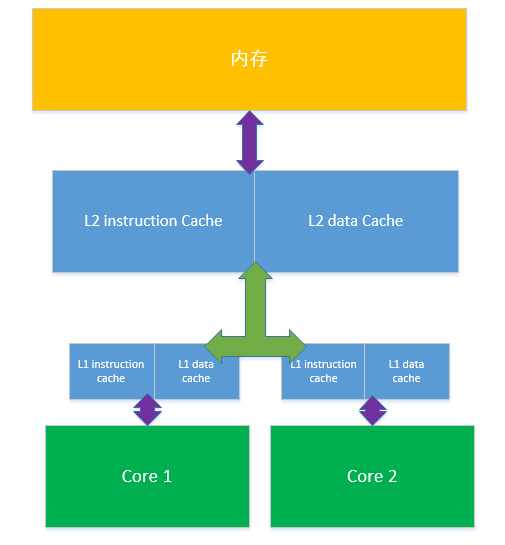

<!-- TOC -->

- [内存模型](#内存模型)

<!-- /TOC -->

# 内存模型

高速缓存:即Cache,介于CPU与内存之间的高速存储器,通常由SRAM（Static Ram，静态存储器）构成,
容量比内存小的多但是交换速度却比内存要快得多,但不如CPU快.
具体细分还包括一级缓存(L1 Cache),二级缓存(L2 Cache),在一些高端CPU上还存在三级缓存,每级缓存的数据命中率大约在80%

系统将CPU在近几个时间段经常访问的内容存入高速缓冲,在处理数据时,首先从高速缓存中找,找不到才回去处理速度较慢的内存中去找.

现代多核CPU中,每核各有独自的L1,共有L2的情况也很常见,因此也就可能出现多线程中的每个线程由不停地处理器处理,不同的处理器处理各自的cache,而各自cache中存在同一个数据时,有可能缓存不一致的情况,这种情况下就需要使缓存保持一致(缓存一致性).

解决方案通常有2个:
1. 在总线加锁的方式
2. 缓存一致性协议

CPU和内存通信是通过总线,在总线上加锁,可以保证某一块内存同时只能被一个处理器使用,但这样会阻塞其他处理器访问内存,降低性能.

缓存一致性协议是在硬件层面实现的,如Intel 的MESI协议,处理器写数据时,如果遇到共享数据(多处理器共用)时,会写入内存并将其他处理器缓存中的该数据的拷贝置为无效,那么其他处理在使用数据时,将不得不重新从内存中读取.
所以在Java等程序中,设计多线程的变量多用volatile关键字修饰,该关键字表示被修饰的变量被修改后,立即被写入内存,其他处理器在处理此变量时直接从内存中读取.

IO多路复用