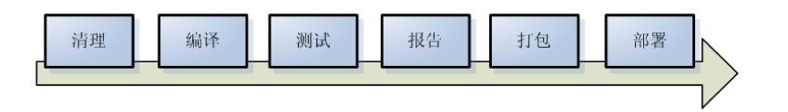

<!-- TOC -->

- [Maven](#maven)
- [Maven配置](#maven配置)
    - [目录结构](#目录结构)
    - [本地仓库](#本地仓库)
- [构建过程](#构建过程)
- [pom.xml](#pomxml)
- [依赖](#依赖)

<!-- /TOC -->

# Maven

依赖管理,构建工具

# Maven配置

## 目录结构


`bin`:二进制文件所在,如mvn.bat(以run方式运行项目),mvnDebug.bat:(以debug方式运行)
`boot`:maven运行需要类加载器
`conf`:Maven配置文件`settings.xml`所在,核心配置文件
`lib`:maven运行依赖jar包

## 本地仓库

本地仓库路径:

```xml
<localRepository>path</localRepository>
```

> maven安装目录下的`settings.xml`是全局配置文件
> `$HOME/.m2/settings.xml`是用户配置文件
> 优先使用用户配置文件

```
|-src
|   |-main
|   |  |-java        —— 存放项目的.java文件
|   |  |-resources   —— 存放项目资源文件,如spring, hibernate配置文件
       |-webapp      —— webapp目录是web工程的主目录
         |-WEB-INF
           |-web.xml
|   |-test
|      |-java        —— 存放所有测试.java文件,如JUnit测试类
|      |-resources   —— 测试资源文件
|-target             —— 目标文件输出位置例如`.class`,`.jar`,`.war`文件
|-pom.xml            —— maven项目核心配置文件
```

# 构建过程



后面的阶段运行时会默认执行前面的阶段

```shell
# 清理编译出的class文件
mvn clean
# 编译
mvn compile
# 测试
mvn test
# 打包,java工程打成jar包,web包打成war包
mvn package
# 安装到服务器上
mvn install
# 运行
tomat:run
```

# pom.xml

```xml
<dependencies>
    <!-- 此项目运行使用junit,所以此项目依赖junit -->
    <dependency>
        <!-- junit的项目名称 -->
        <groupId>junit</groupId>
        <!-- junit的模块名称 -->
        <artifactId>junit</artifactId>
        <!-- junit版本 -->
        <version>4.9</version>
        <!-- 依赖范围:单元测试时使用junit -->
        <scope>test</scope>
    </dependency>
</dependencies>
```

# 依赖

* compile:默认依赖类型,会使用于编译,测试和运行,所以编译范围的依赖会被打包
* provided:只有在当JDK或者一个容器已提供该依赖之后才使用, 在编译和测试时需要,在运行时不需要(容器提供),如:servlet被tomcat容器提供.
* runtime:在测试和运行时需要,但在编译的时候不需要.如:jdbc的驱动包.
* test:在编译和运行时都不需要,它们只有在测试编译和测试运行阶段可用,如:junit
* system:与provided类似,但是你必须显式的提供一个对于本地系统中JAR文件的路径,需要指定systemPath磁盘路径(**不推荐使用**)

> 运行时需要的依赖都会被打包