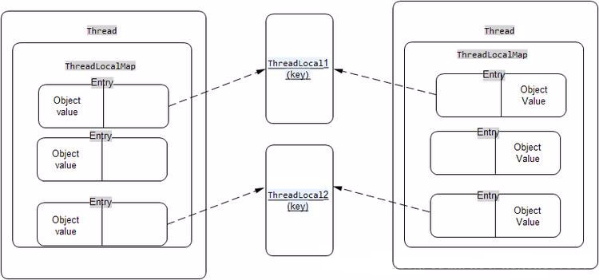

<!-- TOC -->

- [指令重排优化](#指令重排优化)
- [volatile](#volatile)
- [synchronized](#synchronized)
- [ThreadLocal](#threadlocal)
- [队列同步器](#队列同步器)
- [参考](#参考)

<!-- /TOC -->


* 原子性:一组操作,要么全部执行,要么都不执行
* 可见性:某线程对数据的修改,其他线程能立即看到
* 有序性:程序执行的顺序按照代码的先后顺序执行

> 有序性问题涉及到代码的指令重排优化

# 指令重排优化

即为了运行效率的提升,程序的执行顺序不一定和代码的书写顺序保持一致,但程序的执行结果不会有不同
指令重排的依据:数据依赖性,当数据间存在依赖时,不会被重排

```Java
//线程1:
context = loadContext();   //语句1
inited = true;             //语句2

//线程2:
while(!inited ){
  sleep()
}
doSomethingwithconfig(context);
```
指令重排在多线程环境下会给开发者造成意料之外的Bug.
语句1,2之间不具有数据依赖性,则线程1中可能先执行语句2,从而导致线程2的循环结束,执行后续内容,但此时语句1可能并没有执行结束.

所以并发程序的正确执行需要同时满足原子性,可见性,有序性

# volatile

* 禁止指令重排序优化
* 提供多线程访问共享变量的内存可见性,即告诉所有使用该被共享变量的线程,对其读写都可能要和共享内存发生交互

对此共享变量写操作时会有下面操作:

1. 会将缓存的数据写回共享内存
2. 同时使其他线程的该变量声明为无效(不是最新)


volatile保证了可见性,有序性,不能保证原子性.
在volatile修饰的变量的操作语句时,其之前的语句已经执行完毕,其之后的语句没有执行,
指令重排时,也不会将该语句放在其之前语句前执行,不会将该语句放在其之后语句后执行.

应用场景:状态标记,双重校验(单例模式中的双重校验锁)

> 指令重排序优化:
> JVM为了优化指令,提高程序运行效率,在不影响单线程程序执行结果的前提下,尽可能地提高并行度,因此多线程下的优化会给开发者带来问题,
> 可能导致代码的执行顺序可能不是书写的顺序,对变量的修改无法告知所有操作该变量的其他线程.

# synchronized

可以修饰方法,代码块,确保多个线程在同一个时刻,只能有一个线程处于方法或者同步块中,以保证线程对变量访问的可见性和排他性
无论是修饰方法还是代码块都是获取一个对象的监视器(monitor)然后才能进入同步块或者同步方法,
而获取过程是排他的,也就是说同一时刻只有一个线程获取到由synchronized所保护对象的监视器,没有获取到的线程就会被阻塞.

使用synchronized加锁:

对于普通变量,方法所加的锁都是对象锁,一个对象一把锁,互不影响
对于静态变量,方法所加的锁都是类锁,此类的所有对象共用一把锁

锁一共有4种状态,级别从低到高依次是：无锁状态,偏向锁状态,轻量级锁状态和重量级锁状态

自旋锁: 避免挂起线程的一种尝试.如果线程一直无法获得锁,并且能获取的时间点也未知,就会让当前线程做几个空循环
偏向锁: 偏向锁就是一旦线程第一次获得了监视对象,之后让监视对象“偏向”这个线程,之后的多次调用则可以避免CAS操作
轻量级锁: 偏向锁运行在一个线程进入同步块的情况下,当第二个线程加入锁竞争的时候,偏向锁就会升级为轻量级锁
重量级锁: JVM中又叫对象监视器(Monitor),它至少包含一个竞争锁的队列和一个信号阻塞队列(wait队列),前者负责做互斥,后一个用于做线程同步.

锁存储在Java对象头中,其中的`Mark Word`包含: 锁状态, HashCode,分代年龄,是否是偏向锁和锁标记位

> 局部变量不会发生线程安全问题.

> synchronized支持锁重入
> 锁重入:自己可以获取自己的内部锁.
> 当线程请求一个由其它线程持有的对象锁时,该线程会阻塞,而当线程请求由自己持有的对象锁时,如果该锁是重入锁,请求就会成功,否则阻塞

# ThreadLocal


保证数据的安全性和一致性:
锁是一种以时间换空间的方式,而ThreadLocal是一种以空间换时间的方式

Thread,ThreadLocal,ThreadLocalMap,Entry的关系:


ThreadLocalMap的key是ThreadLocal的弱引用,不及时清除key为空的entry,容易出现OOM,
在ThreadLocal的get(),set(),remove()的时候都会清除线程ThreadLocalMap里所有key为null的value


# 队列同步器

AQS: AbstractQueuedSynchronizer(抽象类)

* 用来构建锁或者其他同步组件的基础框架
* 使用一个int成员变量表示同步状态,表示当前共享资源的锁被线程获取的次数
* 使用内置的FIFO队列来完成资源获取线程的排队工作

getState(),setState(),compareAndSetState() 对同步状态进行操作
0的话表示该资源没有被线程加锁,如果是大于0则表示该资源被当前线程重入的次数

支持独占式获取与释放同步状态,共享式获取与释放同步状态

当前线程获取同步状态失败时,用AbstractQueuedSynchronizer的内部类Node封装当前线程以及等待状态等信息,
然后将Node加入FIFO队列,并阻塞当前线程.

* 同步器的主要使用方式是继承, 子类通过继承同步器并重写方法来管理同步状态；
* 子类推荐被定义为自定义同步组件的静态内部类, 同步器自身没有实现任何同步接口, 它仅仅是定义了若干同步状态获取和释放的方法来供自定义同步组件使用.


# 参考

[Java并发编程:volatile关键字解析](http://www.cnblogs.com/dolphin0520/p/3920373.html)