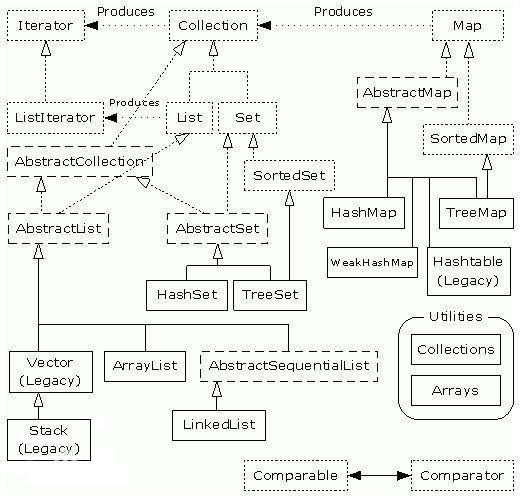

<!-- TOC -->

- [collection](#collection)
- [Map](#map)
    - [HashMap](#hashmap)
        - [原理](#原理)
    - [HashTable](#hashtable)
        - [原理](#原理-1)
    - [LinedHashMap](#linedhashmap)
    - [TreeMap](#treemap)
    - [CocurrentHashMap](#cocurrenthashmap)
- [List](#list)
    - [ArrarList](#arrarlist)
    - [LinkedList](#linkedlist)
    - [Vector](#vector)
- [Set](#set)
    - [HashSet](#hashset)
        - [原理](#原理-2)
    - [TreeSet](#treeset)
    - [LinkedHashSet](#linkedhashset)
- [Queue](#queue)
- [总结](#总结)

<!-- /TOC -->


# collection


Collection:集合层次的顶层接口
Collections:提供了操作集合的静态方法的类




实线边框的是实现类, 比如ArrayList, LinkedList, HashMap等, 折线边框的是抽象类, 比如AbstractCollection, AbstractList, AbstractMap等, 而点线边框的是接口, 比如Collection, Iterator, List等.

上述所有的集合类, 都实现了Iterator接口, 这是一个用于遍历集合中元素的接口, 主要包含hasNext(), next(), remove()三种方法.
它的一个子接口LinkedIterator在它的基础上又添加了三种方法, 分别是add(),previous(),hasPrevious().
也就是说如果是实现Iterator接口, 那么在遍历集合中元素的时候, 只能往后遍历, 被遍历后的元素不会在遍历到, 
通常无序集合实现的都是这个接口, 比如HashSet, HashMap；
而那些元素有序的集合, 实现的一般都是LinkedIterator接口, 实现这个接口的集合可以双向遍历, 既可以通过next()访问下一个元素, 又可以通过previous()访问前一个元素, 比如ArrayList.


# Map

## HashMap

* 实现Map接口
* 可以接受null键和值
* 非synchronized,线程不安全
* 元素存储顺序可能会变


@TODO
HashMap的迭代器(Iterator)是fail-fast迭代器, 而Hashtable的enumerator迭代器不是fail-fast的.
所以当有其它线程改变了HashMap的结构（增加或者移除元素）, 将会抛出ConcurrentModificationException, 
但迭代器本身的remove()方法移除元素则不会抛出ConcurrentModificationException异常.
但这并不是一个一定发生的行为, 要看JVM.这条同样也是Enumeration和Iterator的区别

@TODO
Fail-safe和iterator迭代器相关.
如果某个集合对象创建了Iterator或者ListIterator, 然后其它的线程试图删除或者插入一个元素, 将会抛出ConcurrentModificationException异常.
但其它线程通过set()方法更改集合对象是允许的, 因为这并没有从“结构上”更改集合.
但是假如已经从结构上进行了更改, 再调用set()方法, 将会抛出IllegalArgumentException异常


### 原理

底层实际上是一个数组, 以put()方法实现添加元素, 以key计算hashcode,从而确定value的存储位置.
若key重复则覆盖现有value, 返回原来的value, 否则返回null.
若添加元素时发生哈希碰撞,则会将元素放在同一个位置,以链表的形式进行存储
同一位置处的value数量达到8后(8次key的hashcode相同), 此位置的链表结构会重构为红黑树.

HashMap的默认大小为16,即大小为16的数据,即使只存储一个元素.
默认的负载因子大小为0.75,即使用了75%的空间(默认空间使用了12个位置)后将自动扩容为原来的2倍,
随着扩容其中的对象也将rehashing,此时链表中的元素会被反置.
此时,在多线程的情况下,可能会发生条件竞争(race condition),
如果发生则会进入死循环,所以并不推荐在多线程的情况下使用HashMap


关于key的选择
要计算hashCode(),就要防止键改变,存取时键的值不同,其hashcode会不同,这样是不能取出值的.
其实使用不可变的、声明作final的对象,并且采用合适的equals()和hashCode()方法的话,将会减少碰撞的发生,提高效率.
不可变性使得能够缓存不同键的hashcode,这将提高整个获取对象的速度,使用String,Interger这样的wrapper类作为键是非常好的选择
因为包装类的一个对象一经创建,其所代表的值将不再变化,也就是说不能通过某个指向(refer to)它的reference来改变它的值,直至它被垃圾回收器回收

```Java
Map m = Collections.synchronizeMap(hashMap);
```
## HashTable


实现Map接口
Hashtable不可以接受null键值和值
synchronized

Java5以上推荐使用ConcurrentHashMap

### 原理


## LinedHashMap

* 保存了插入时的顺序
* HashMap的子类

## TreeMap

* 元素存储顺序不会变


## CocurrentHashMap

* HashTable的替代,比HashTable的扩展性更好

# List

Collection <-- List

* 元素有序
* 可以重复

## ArrarList

* 数组
* 自增空间0.5倍

## LinkedList

* 双向链表
* 并实现了Queue接口

## Vector

* 同步
* 自增空间1倍


# Set

Collection <-- Set

* 元素无序
* 不能重复

> Set不保证插入有序是指Set这个接口的规范, 实现类只要遵循这个规范即可, 也能写出有序的set

## HashSet

Collection <-- Set <-- HashSet

* 实现Set接口

### 原理

通过计算hashcode和equals()方法来保证元素没有重复

add()方法添加元素,返回执行结果(boolean)
底层以HashMap形式存在
主要功能方法实际上都是调用HashMap的方法
基本上可以说HashSet就是利用HashMap来实现的

add()其实是调用HashMap的put, 在遇到key重复时, 返回的是false, 否则返回true
set中的元素实质上是HashMap的key, 所有元素的value都指向Object对象,
由于使用不到HashMap的value, 所以set不会为每个value分配一个内存空间, 因而内存占用少

size()
isEmpty()
remove()
contains()
clear()
等也都是内部调用HashMap的方法.

> 可以推测, TreeSet内部也是利用TreeMap实现
> HashSet底层声明了一个HashMap, HashSet做了一层包装, 操作HashSet里的元素时其实是在操作HashMap里的元素.

## TreeSet

Collection <-- Set <-- TreeSet

同样, TreeSet就是利用TreeMap来实现的
TreeSet是里面的内容有序(按照一定规则排序), 但不是指元素的添加顺序

TreeSet构造函数:
```Java
TreeSet --> TreeMap --> NavigableMap(接口)
<-->
NavigableMap m = new TreeMap<>();
```
 常用方法同HashSet类似, 封装了TreeMap的方法

> TreeSet底层也是声明了一个TreeMap, 操作TreeSet里的元素其实是操作TreeMap里的元素.

## LinkedHashSet

有序

访问快速-->HashSet
排序-->TreeSet
记录插入时顺序-->LinedHashSet.

# Queue

FCFS算法(First Come, First Serve)


# 总结

ArrarList 和 Vector 几乎相同
HashMap 和 Hashtable 几乎相同